# Angular-Sepetle.com-Project

-Bu proje, Angular kullanılarak yapılmıştır.
-Proje temel e-ticaret sitesi gerekliliklerine göre yapılmaya çalışılmıştır.
#
* Projede temel Angular yapılarından olan Reactive Forms, Directives, Routing ve Service yapıları kullanılmıştır.
* Veriler bir serviste tutulup, diğer componentlerde kullanılmıştır.
* Component geçişleri, Routing ile sağlanmıştır.
* Header ve Footer oluşturulup, bütün componentlerde kullanımı sağlanmıştır.
#
* Ana Sayfada datamızda yer alan markalar gözükmektedir. Tıklanma sonrasında ürünler sayfasına geçiş yapmak için kullaılmaktadır.
* Markaların altında ise rastgele olarak gelen belli sayıda ürün bulunmaktadır.
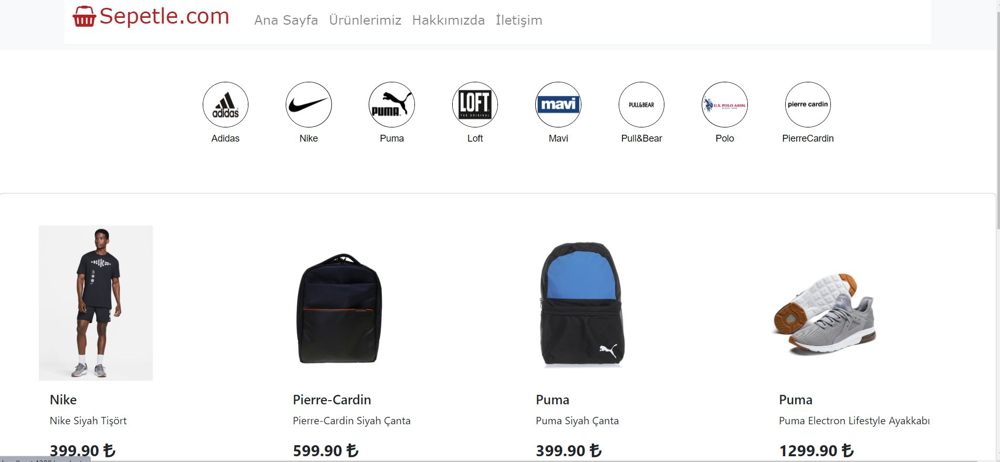
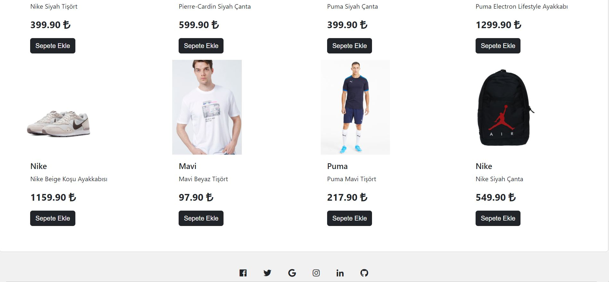
#
* Ürünlerimiz sayfamızda bir arama butonu bulunmaktadır. Girilen her türlü karakter ile eşleşen ürünler ekranda gözükmektedir.
* Arama butonu altında basit bir kategori seçimi bulunmaktadır. Burdaki seçime göre ürünler filtrelenmektedir.
* Sepete Git butonu ile sepete ulaşabilmemiz sağlanmıştır.

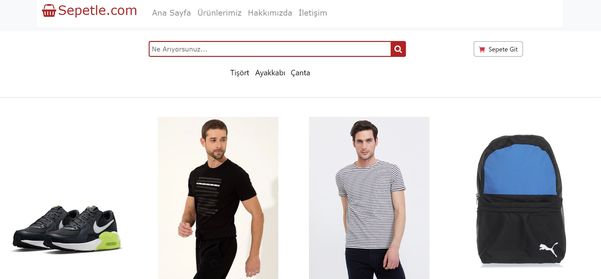
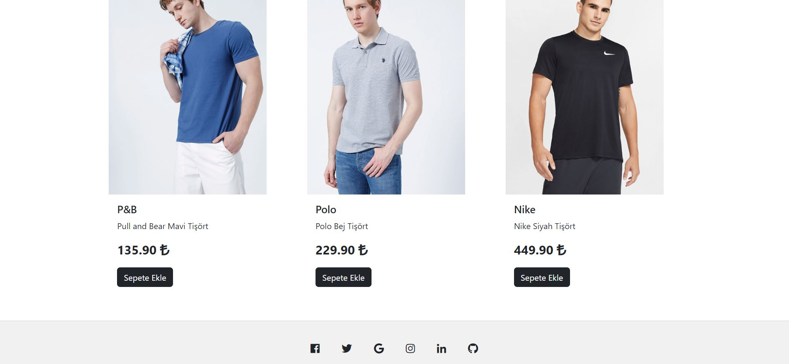

*Sepete Ekle butonuna tıklandığında, ekrana bir uyarı verilmektedir.

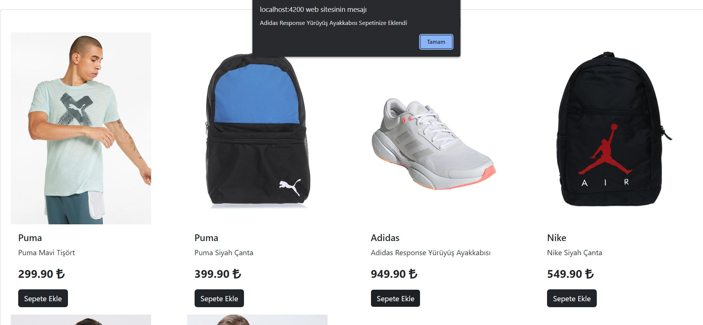
#
* Hakkımızda ekranı oluşturulmuştur.
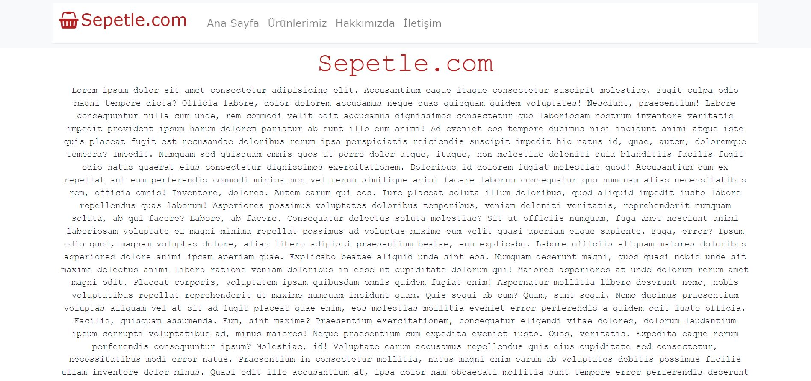
#
* İletişim ekranında adres, telefon, mail ve harita bilgisine yer verilmiştir.
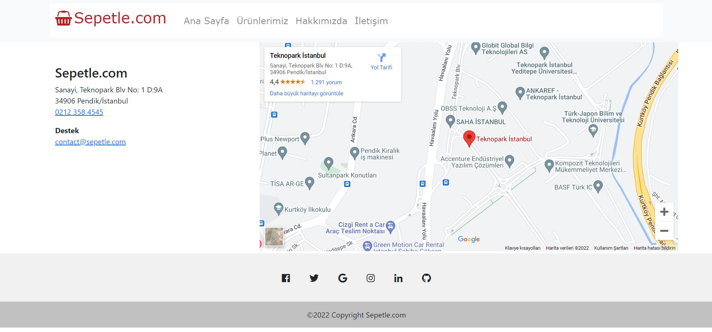
#
* Sepet ekranında ise sepet hakkındaki bilgiler ve ödeme ekranı bulunmaktadır.
* Ürünlerin tamamını veya her birini tek tek kaldırma imkanı sunulmuştur.,

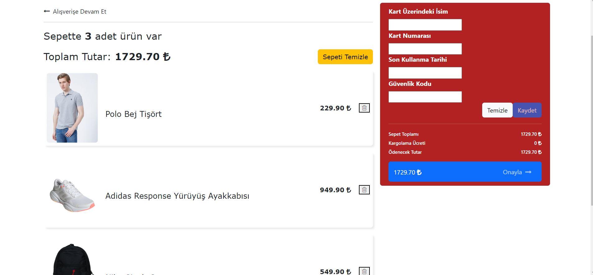

* Ödeme Formu belli standartlara uygun olmadığı takdirde uyarı veren bir Reactive Formdur.
* Standart format sağlanmadığı takdirde kaydetme ve sipariş oluşturma butonları aktif olmayacaktır.

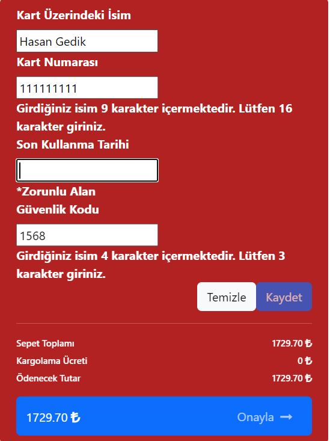
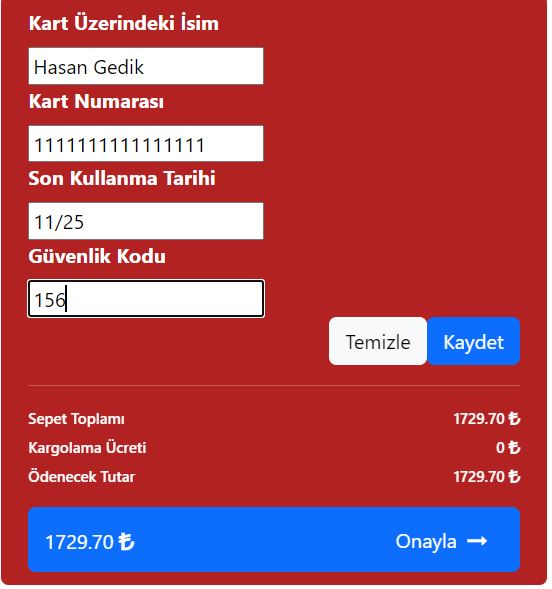

* Şartlar sağlandığı ve sipariş oluşturma butonuna tıklandığında ise bir uyarı ile sipariş alındı mesajı verilmektedir.

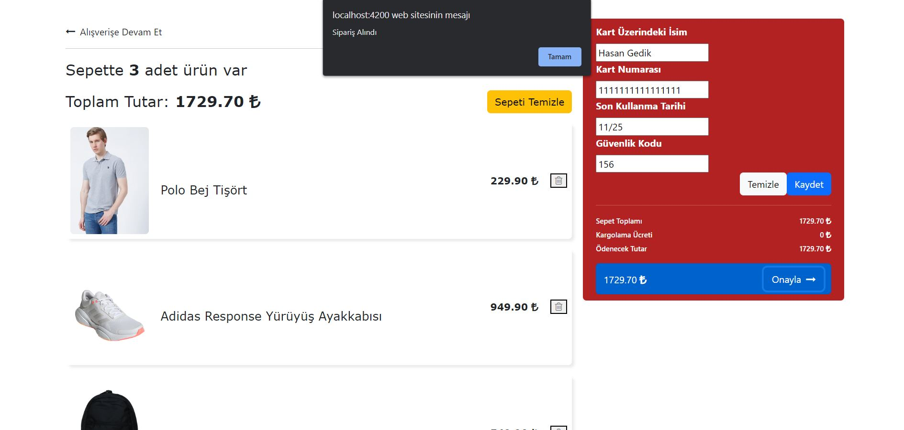

